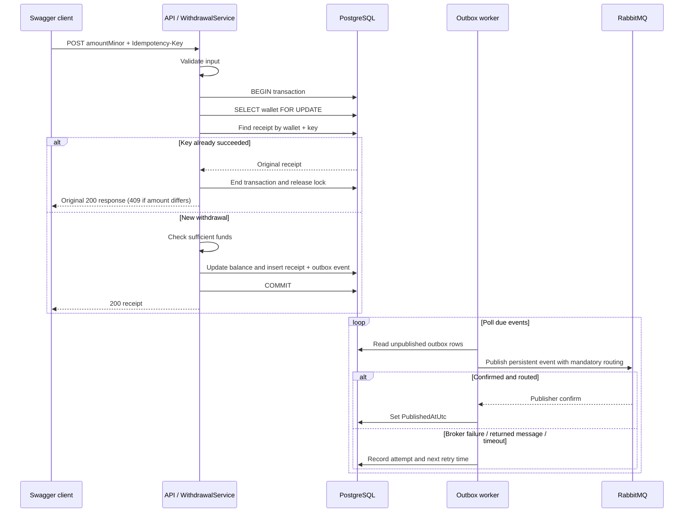

# withdrawal flow

Insufficient funds, missing wallets, or database errors exit the transaction without committing. Each successful withdrawal has a unique `(WalletId, IdempotencyKey)` and exactly one stored outbox record, enforced by unique database indexes. This does not imply exactly one broker delivery.

A failure between broker confirmation and `PublishedAtUtc` being saved leaves a pending event. The next cycle publishes it again with the same event ID. A future consumer must record processed event IDs atomically with its own effects and acknowledge only after that commit.
